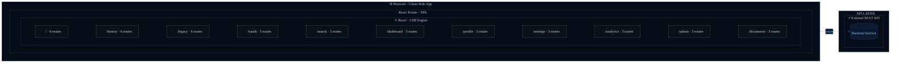

# Rendering Architecture

```mermaid
%%{init:{'theme':'base','themeVariables':{'background':'#060810','primaryColor':'#0c1a30','primaryTextColor':'#7dd3fc','primaryBorderColor':'#0e3a6e','edgeLabelBackground':'#0c1a30','lineColor':'#334155','secondaryColor':'#0f172a','clusterBkg':'#060c18','clusterBorder':'#1e3a5f','fontFamily':'JetBrains Mono','fontSize':'14'}}}%%
graph LR
  classDef ssr fill:#0d1a0d,stroke:#16a34a,color:#86efac
  classDef csr fill:#2d1200,stroke:#c2410c,color:#fb923c
  classDef ssg fill:#1a0d1a,stroke:#7c3aed,color:#c4b5fd
  classDef isr fill:#1a1a0d,stroke:#ca8a04,color:#fde047
  classDef ppr fill:#0d1a2d,stroke:#2563eb,color:#93c5fd
  classDef unk fill:#1a1a1a,stroke:#6b7280,color:#9ca3af
  classDef pkg fill:#0c1018,stroke:#475569,color:#cbd5e1
  classDef muted fill:#0a0d14,stroke:#374151,color:#64748b,stroke-dasharray: 3 3
  classDef hdr fill:#06080f,stroke:#1e3a5f,color:#7dd3fc
  subgraph BROWSER["🌐 Browser · Client-Side App"]
    subgraph ROUTER["🧭 React Router · SPA"]
      subgraph REACT["⚛ React · CSR Engine"]
        T1_root["📁 / · 6 routes"]:::pkg
        T1_history["📁 /history · 6 routes"]:::pkg
        T1_legacy["📁 /legacy · 6 routes"]:::pkg
        T1_oauth["📁 /oauth · 3 routes"]:::pkg
        T1_search["📁 /search · 3 routes"]:::pkg
        T1_dashboard["📁 /dashboard · 3 routes"]:::pkg
        T1_profile["📁 /profile · 3 routes"]:::pkg
        T1_settings["📁 /settings · 3 routes"]:::pkg
        T1_analytics["📁 /analytics · 3 routes"]:::pkg
        T1_admin["📁 /admin · 3 routes"]:::pkg
        T1_documents["📁 /documents · 3 routes"]:::pkg
        T1_root ~~~ T1_history ~~~ T1_legacy ~~~ T1_oauth ~~~ T1_search ~~~ T1_dashboard ~~~ T1_profile ~~~ T1_settings ~~~ T1_analytics ~~~ T1_admin ~~~ T1_documents
      end
    end
  end
  subgraph DATALAYER["🔌 API LAYER"]
    subgraph API_G["⚡ External REST API"]
      API_GATEWAY[("Backend Service")]
    end
  end
  BROWSER -.->|"axios"| API_GATEWAY
```
