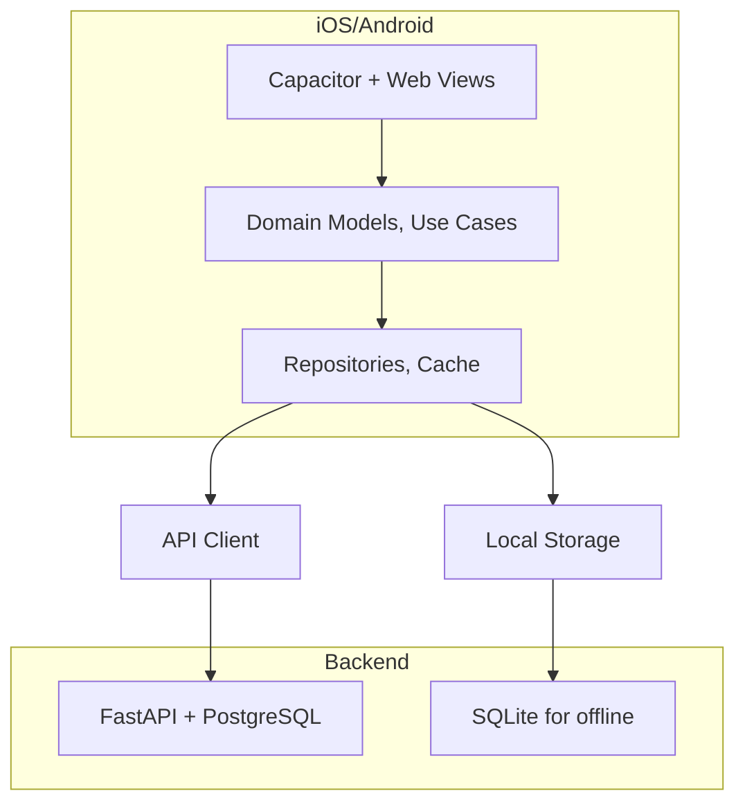
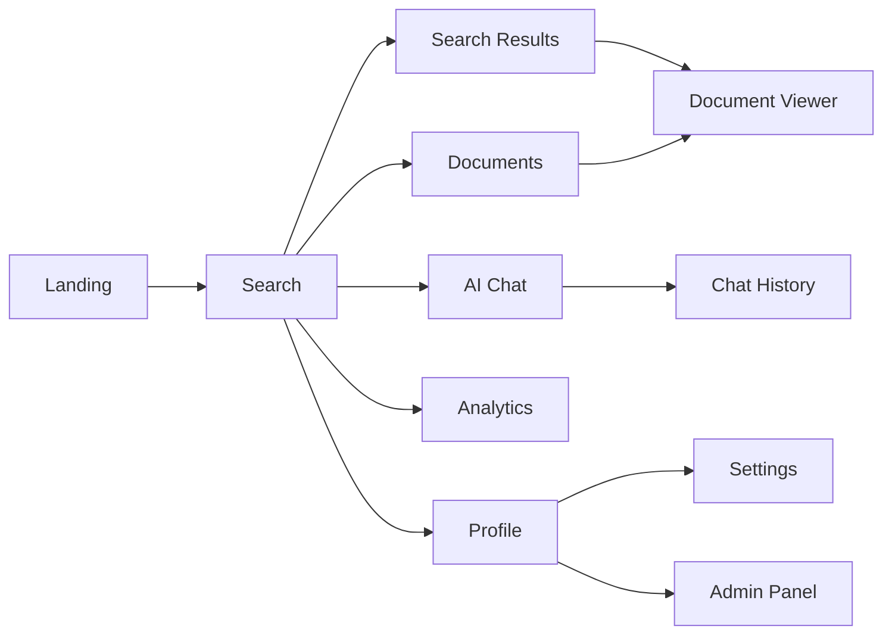

# Design Document: Nebula Mobile App

## Overview

The Nebula Mobile App extends the existing Nebula Search Engine platform to iOS and Android devices, providing full access to search, document management, AI assistant, analytics, and administrative capabilities. The app maintains the same core principles as the web application: privacy-first, offline-capable, AI-powered, and high-performance.

This design document outlines the complete mobile architecture, components, data models, API integration strategy, offline capabilities, and implementation approach. The mobile app will be built using **Capacitor** (wrapping the existing React frontend) with native plugin integrations for mobile-specific features like push notifications, camera, speech recognition, and biometric authentication.

---

## Architecture

The mobile app follows a layered architecture pattern with clear separation of concerns:



### Layer Descriptions

#### 1. UI Layer
- **Responsibility**: Render screens, handle user input, manage navigation
- **Components**: Screens, Views, Components, Bottom Navigation (from existing web frontend)
- **State Management**: Local state for UI, global state for shared data

#### 2. Business Logic Layer
- **Responsibility**: Implement domain rules, coordinate use cases
- **Components**: Use Cases, Domain Models, Validators
- **Patterns**: Clean Architecture, Repository Pattern

#### 3. Data Layer
- **Responsibility**: Data retrieval, caching, persistence
- **Components**: Repositories, API Client, Cache Manager, Local Storage
- **Patterns**: Repository Pattern, CQRS (simplified)

#### 4. Network Layer
- **Responsibility**: HTTP communication, authentication, error handling
- **Components**: API Client, Interceptors, Request/Response Transformers

---

## Core Data Models

```pascal
STRUCTURE User
  id: Integer
  email: String
  name: String
  role: String ("user" | "admin")
  email_verified: Boolean
  created_at: String (ISO 8601)
  last_login: String (ISO 8601)
  avatar_url: String
  storage_used_bytes: Integer
  storage_limit_bytes: Integer
END STRUCTURE

---

## Capacitor Setup

The mobile app uses **Capacitor 6.2** to wrap the existing web frontend with native mobile capabilities.

### Initial Setup

```bash
cd mobile
npm install
npx cap add android  # First time only
npx cap add ios      # First time only (requires macOS)
npx cap sync
```

### Build and Run

```bash
# Build web frontend and sync
npm run build

# Run on Android
npm run android

# Run on iOS (macOS only)
npm run ios

# Build debug APK
npm run apk:debug
```

### Capacitor Plugins

| Plugin | Purpose | Platform |
|--------|---------|----------|
| @capacitor/push-notifications | Push notification handling | iOS, Android |
| @capacitor/camera | Photo capture | iOS, Android |
| @capacitor/clipboard | Clipboard operations | iOS, Android |
| @capacitor/filesystem | File operations | iOS, Android |
| @capacitor/preferences | Local storage | iOS, Android |
| @capacitor/network | Network status | iOS, Android |
| @capacitor/share | Share functionality | iOS, Android |
| @capacitor-community/speech-recognition | Voice input | iOS, Android |
| @capacitor/app | App lifecycle | iOS, Android |

---

## Core Data Models

STRUCTURE SearchQuery
  id: Integer
  user_id: Integer
  query_text: String
  search_mode: String ("web" | "vector" | "hybrid" | "ai")
  filters: JSON
  result_count: Integer
  response_time_ms: Integer
  created_at: String (ISO 8601)
END STRUCTURE

STRUCTURE SavedSearch
  id: Integer
  user_id: Integer
  name: String
  query_text: String
  filters: JSON
  category: String
  created_at: String (ISO 8601)
  updated_at: String (ISO 8601)
END STRUCTURE

STRUCTURE Document
  id: Integer
  user_id: Integer
  filename: String
  content_type: String
  file_size_bytes: Integer
  file_path: String
  indexed: Boolean
  indexed_at: String (ISO 8601)
  created_at: String (ISO 8601)
  title: String
  description: String
  tags: JSON Array
  metadata: JSON
END STRUCTURE

STRUCTURE DocumentVersion
  id: Integer
  document_id: Integer
  version: Integer
  file_path: String
  created_at: String (ISO 8601)
  uploaded_by: Integer
END STRUCTURE

STRUCTURE SearchResult
  id: Integer
  document_id: Integer
  title: String
  snippet: String
  url: String
  source: String ("web" | "document" | "ai")
  score: Float
  highlights: JSON Array
  document: Document
END STRUCTURE

STRUCTURE AIAnswer
  id: Integer
  user_id: Integer
  query: String
  answer: String
  provider: String
  citations: JSON Array
  tokens_used: Integer
  response_time_ms: Integer
  created_at: String (ISO 8601)
END STRUCTURE

STRUCTURE ChatMessage
  id: Integer
  conversation_id: Integer
  role: String ("user" | "assistant")
  content: String
  created_at: String (ISO 8601)
END STRUCTURE

STRUCTURE ChatConversation
  id: Integer
  user_id: Integer
  title: String
  last_message_at: String (ISO 8601)
  created_at: String (ISO 8601)
END STRUCTURE

STRUCTURE Notification
  id: Integer
  user_id: Integer
  type: String ("search_update" | "document_alert" | "ai_response" | "system")
  category: String
  title: String
  message: String
  data: JSON
  is_read: Boolean
  read_at: String (ISO 8601)
  expires_at: String (ISO 8601)
  created_at: String (ISO 8601)
END STRUCTURE

STRUCTURE AnalyticsMetric
  id: Integer
  user_id: Integer
  metric_type: String ("search" | "document" | "ai")
  metric_date: String (ISO 8601)
  value: Integer
  metadata: JSON
END STRUCTURE

STRUCTURE Session
  id: Integer
  user_id: Integer
  device_id: String
  device_name: String
  device_type: String ("ios" | "android")
  ip_address: String
  user_agent: String
  is_active: Boolean
  last_active: String (ISO 8601)
  created_at: String (ISO 8601)
END STRUCTURE
```

---

## API Integration

The mobile app integrates with the existing FastAPI backend using a well-defined API contract.

### API Base Configuration

```pascal
CONSTANT API_BASE_URL: String = getSetting("apiBaseUrl", "https://api.nebula.search")
CONSTANT API_VERSION: String = "v1"
CONSTANT BASE_PATH: String = "/api/" + API_VERSION

CONSTANT ENDPOINTS: RECORD
  auth_login: String = BASE_PATH + "/auth/login"
  auth_signup: String = BASE_PATH + "/auth/signup"
  auth_refresh: String = BASE_PATH + "/auth/refresh"
  auth_logout: String = BASE_PATH + "/auth/logout"
  search_unified: String = BASE_PATH + "/search"
  search_suggestions: String = BASE_PATH + "/search/suggestions"
  documents_list: String = BASE_PATH + "/documents"
  documents_upload: String = BASE_PATH + "/documents"
  documents_download: String = BASE_PATH + "/documents/{id}/download"
  ai_ask: String = BASE_PATH + "/ai/ask"
  ai_stream: String = BASE_PATH + "/ai/ask/stream"
  ai_chat_history: String = BASE_PATH + "/ai/chat/history"
  notifications_list: String = BASE_PATH + "/notifications"
  notifications_count: String = BASE_PATH + "/notifications/unread-count"
  analytics_usage: String = BASE_PATH + "/analytics/usage"
  analytics_search: String = BASE_PATH + "/analytics/search"
  admin_users: String = BASE_PATH + "/admin/users"
END RECORD
```

### Request/Response Models

```pascal
STRUCTURE APIRequest
  method: String ("GET" | "POST" | "PUT" | "DELETE" | "PATCH")
  path: String
  headers: Dictionary<String, String>
  query_params: Dictionary<String, String>
  body: JSON
END STRUCTURE

STRUCTURE APIResponse
  status_code: Integer
  headers: Dictionary<String, String>
  body: JSON
  error: APIError
END STRUCTURE

STRUCTURE APIError
  code: String
  message: String
  details: JSON
  retryable: Boolean
END STRUCTURE
```

### Authentication Flow

```pascal
PROCEDURE authenticate_user(credentials)
  INPUT: credentials (email, password)
  OUTPUT: AuthResult
  
  SEQUENCE
    // Step 1: Send login request
    request ← create_login_request(credentials)
    response ← api_client.send(request)
    
    IF response.status_code = 200 THEN
      // Step 2: Store tokens securely
      token_storage.store_access_token(response.body.access_token)
      token_storage.store_refresh_token(response.body.refresh_token)
      token_storage.store_token_expiry(response.body.expires_at)
      
      // Step 3: Fetch user profile
      user ← fetch_user_profile(response.body.access_token)
      
      RETURN Success(user)
    ELSE IF response.status_code = 401 THEN
      RETURN Error("Invalid credentials")
    ELSE IF response.status_code = 429 THEN
      RETURN Error("Too many login attempts")
    ELSE
      RETURN Error("Authentication failed")
    END IF
  END SEQUENCE
END PROCEDURE

PROCEDURE refresh_access_token()
  INPUT: None
  OUTPUT: AuthResult
  
  SEQUENCE
    refresh_token ← token_storage.get_refresh_token()
    
    IF refresh_token IS NULL THEN
      RETURN Error("No refresh token available")
    END IF
    
    request ← create_refresh_request(refresh_token)
    response ← api_client.send(request)
    
    IF response.status_code = 200 THEN
      token_storage.store_access_token(response.body.access_token)
      token_storage.store_token_expiry(response.body.expires_at)
      
      RETURN Success()
    ELSE IF response.status_code = 401 THEN
      // Refresh token expired, require re-login
      token_storage.clear_all_tokens()
      RETURN Error("Session expired")
    ELSE
      RETURN Error("Token refresh failed")
    END IF
  END SEQUENCE
END PROCEDURE
```

---

## Offline Strategy

The mobile app implements a comprehensive offline-first strategy with local caching and background synchronization.

### Offline Data Architecture

```pascal
STRUCTURE OfflineCache
  id: Integer
  key: String (unique cache key)
  data: JSON (serialized response)
  expires_at: String (ISO 8601)
  created_at: String (ISO 8601)
  last_updated: String (ISO 8601)
END STRUCTURE

STRUCTURE PendingOperation
  id: Integer
  operation_type: String ("sync" | "upload" | "delete" | "update")
  resource_type: String ("document" | "notification" | "settings")
  resource_id: Integer
  data: JSON
  status: String ("pending" | "processing" | "completed" | "failed")
  error: String
  retry_count: Integer
  created_at: String (ISO 8601)
  last_retry_at: String (ISO 8601)
END STRUCTURE
```

### Cache Invalidation Strategy

| Cache Type | TTL | Invalidate On |
|------------|-----|---------------|
| Search Results | 24 hours | New search, cache cleared |
| Documents | 30 days | Document updated, cache cleared |
| User Profile | 1 hour | User updates profile |
| Notifications | Session | Notification read, cleared |
| Settings | Persistent | User changes settings |

### Sync Process

```pascal
PROCEDURE sync_offline_changes()
  INPUT: None
  OUTPUT: SyncResult
  
  SEQUENCE
    // Step 1: Check network connectivity
    IF NOT network_manager.is_connected() THEN
      RETURN Result(success: false, error: "No network connection")
    END IF
    
    // Step 2: Process pending operations
    pending_ops ← pending_ops_repository.get_pending()
    
    FOR each op IN pending_ops DO
      result ← execute_operation(op)
      
      IF result.success THEN
        pending_ops_repository.mark_completed(op.id)
      ELSE
        pending_ops_repository.mark_failed(op.id, result.error)
      END IF
    END FOR
    
    // Step 3: Fetch server updates
    last_sync ← sync_state.get_last_sync()
    updates ← api_client.get_server_updates(since: last_sync)
    
    FOR each update IN updates DO
      local_cache.update_or_insert(update)
    END FOR
    
    // Step 4: Update sync state
    sync_state.set_last_sync(now())
    
    RETURN Result(success: true)
  END SEQUENCE
END PROCEDURE
```

---

## Component Architecture

### Screen Structure

The mobile app follows a screen-based navigation pattern with a bottom navigation bar for primary destinations.



### Core Screens

#### 1. Search Screen
```pascal
STRUCTURE SearchScreenState
  query: String
  search_mode: SearchMode
  results: List<SearchResult>
  is_loading: Boolean
  has_more: Boolean
  filters_visible: Boolean
  saved_searches: List<SavedSearch>
END STRUCTURE

PROCEDURE handle_search(query)
  INPUT: query (String)
  OUTPUT: None
  
  SEQUENCE
    IF query IS EMPTY OR NULL THEN
      RETURN
    END IF
    
    state.is_loading ← true
    state.results ← []
    
    // Search with cache
    cached_results ← cache.get_search_results(query)
    
    IF cached_results IS NOT EMPTY THEN
      state.results ← cached_results
      state.has_more ← false
    END IF
    
    // Fetch fresh results
    results ← search_service.search(query, state.search_mode)
    
    state.results ← results
    state.is_loading ← false
    
    // Cache for offline
    cache.set_search_results(query, results)
    
    // Save to search history
    search_history.add(query, results.length)
  END SEQUENCE
END PROCEDURE
```

#### 2. Document Management Screen
```pascal
STRUCTURE DocumentScreenState
  documents: List<Document>
  is_uploading: Boolean
  selected_documents: Set<Integer>
  filter: DocumentFilter
  search_query: String
END STRUCTURE

PROCEDURE handle_upload_document(file)
  INPUT: file (FileObject)
  OUTPUT: None
  
  SEQUENCE
    // Validate file
    IF NOT file_validator.is_valid(file) THEN
      show_error("Invalid file type or size")
      RETURN
    END IF
    
    state.is_uploading ← true
    
    // Upload with offline fallback
    upload_task ← document_service.upload(file)
    
    IF network_manager.is_connected() THEN
      result ← await upload_task
      state.is_uploading ← false
      
      IF result.success THEN
        show_success("Document uploaded successfully")
      ELSE
        show_error(result.error)
      END IF
    ELSE
      // Save for offline sync
      pending_ops.add("upload_document", file)
      state.is_uploading ← false
      show_success("Document queued for upload")
    END IF
  END SEQUENCE
END PROCEDURE
```

#### 3. AI Chat Screen
```pascal
STRUCTURE ChatScreenState
  messages: List<ChatMessage>
  is_typing: Boolean
  conversation_id: Integer
  input_text: String
  suggestions: List<String>
END STRUCTURE

PROCEDURE handle_send_message(text)
  INPUT: text (String)
  OUTPUT: None
  
  SEQUENCE
    // Add user message locally
    user_msg ← create_message("user", text)
    state.messages.append(user_msg)
    state.input_text ← ""
    
    // Show typing indicator
    state.is_typing ← true
    
    // Stream response
    stream ← ai_service.stream_response(text, state.conversation_id)
    
    ai_response ← ""
    
    FOR EACH chunk IN stream DO
      ai_response.append(chunk)
      
      // Update UI with streaming text
      update_typing_message(ai_response)
    END FOR
    
    // Add AI response
    ai_msg ← create_message("assistant", ai_response)
    state.messages.append(ai_msg)
    state.is_typing ← false
  END SEQUENCE
END PROCEDURE
```

---

## State Management

The mobile app uses a hybrid state management approach:

### Global State (Shared across screens)
- User authentication state
- Offline connectivity status
- Theme settings
- Notification preferences
- Sync status

### Local Screen State (Per screen)
- Search query and results
- Form input values
- UI visibility states
- Loading states

### State Management Library

For React Native, we recommend using Zustand for lightweight global state:

```typescript
// Example Zustand store
import { create } from 'zustand';
import { persist } from 'zustand/middleware';

interface AppState {
  user: User | null;
  isAuthenticated: boolean;
  isOnline: boolean;
  theme: 'light' | 'dark' | 'system';
  syncStatus: 'idle' | 'syncing' | 'failed';
  
  // Actions
  setUser: (user: User | null) => void;
  setOnline: (isOnline: boolean) => void;
  setTheme: (theme: 'light' | 'dark' | 'system') => void;
  startSync: () => void;
  completeSync: () => void;
}

export const useAppStore = create<AppState>()(
  persist(
    (set) => ({
      user: null,
      isAuthenticated: false,
      isOnline: true,
      theme: 'system',
      syncStatus: 'idle',
      
      setUser: (user) => set({ user, isAuthenticated: !!user }),
      setOnline: (isOnline) => set({ isOnline }),
      setTheme: (theme) => set({ theme }),
      startSync: () => set({ syncStatus: 'syncing' }),
      completeSync: () => set({ syncStatus: 'idle' }),
    }),
    {
      name: 'app-state',
      partialize: (state) => ({
        user: state.user,
        theme: state.theme,
      }),
    }
  )
);
```

---

## Testing Strategy

### Unit Testing
- Test domain models and validators
- Test use cases with mocked repositories
- Test state management logic

### Integration Testing
- Test API client integration
- Test cache operations
- Test sync process
- Test database operations

### E2E Testing
- Test user flows (search → results → document)
- Test offline/online transitions
- Test authentication flows
- Test push notification handling

### Test Coverage Goals
- Unit tests: 80%+ coverage
- Integration tests: All critical paths
- E2E tests: Key user journeys

### Test Tools

| Type | Tool | Language |
|------|------|----------|
| Unit | Jest/pytest | TypeScript/Python |
| Integration | Supertest | TypeScript/Python |
| E2E | Detox/Appium | JavaScript/Java |
| PBT | fast-check/hypothesis | TypeScript/Python |

---

## Performance Considerations

### Performance Targets

| Metric | Target | Measurement |
|--------|--------|-------------|
| App launch time | < 2 seconds | Cold start |
| Search response | < 500ms | Network + render |
| Document load | < 1 second | Cache hit |
| List scroll | 60 FPS | Render performance |
| Memory usage | < 200 MB | Average |
| Battery impact | < 5% per hour | Background sync |

### Optimization Strategies

#### 1. Lazy Loading
- Load screens on demand
- Paginate search results
- Virtualized lists for large datasets

#### 2. Caching Strategy
```pascal
PROCEDURE get_search_results(query)
  INPUT: query (String)
  OUTPUT: SearchResult[]
  
  SEQUENCE
    // Check memory cache
    IF memory_cache.contains(query) THEN
      RETURN memory_cache.get(query)
    END IF
    
    // Check disk cache
    IF disk_cache.contains(query) THEN
      result ← disk_cache.get(query)
      memory_cache.put(query, result)
      RETURN result
    END IF
    
    // Fetch from API
    result ← api_client.search(query)
    
    // Cache result
    memory_cache.put(query, result)
    disk_cache.put(query, result)
    
    RETURN result
  END SEQUENCE
END PROCEDURE
```

#### 3. Network Optimization
- Compress requests/responses
- Batch operations when possible
- Use WebSocket for real-time updates
- Implement request deduplication

#### 4. Image Optimization
- Use responsive images
- Implement placeholder loading
- Cache processed images
- Use appropriate formats (WebP, AVIF)

---

## Security Considerations

### Authentication & Authorization
- JWT tokens with short expiry (15-30 minutes)
- Refresh tokens with long expiry (7 days)
- Biometric authentication for local access
- MFA support for sensitive operations

### Data Protection
- Encrypt sensitive data at rest (SQLite encryption)
- Use secure key storage (Keychain/Keystore)
- Implement SSL pinning for API calls
- Clear sensitive data on logout

### Input Validation
- Validate all user inputs
- Sanitize data before storage
- Prevent SQL injection
- Prevent XSS in web views

### Secure Storage

```pascal
STRUCTURE SecureStorage
  FUNCTION store_access_token(token: String)
  FUNCTION get_access_token(): String
  FUNCTION store_refresh_token(token: String)
  FUNCTION get_refresh_token(): String
  FUNCTION store_biometric_secret(secret: String)
  FUNCTION get_biometric_secret(): String
END STRUCTURE
```

---

## Accessibility

### Accessibility Features
- Full screen reader support (VoiceOver/TalkBack)
- Dynamic text scaling (up to 200%)
- High contrast mode
- Reduced motion support
- Keyboard navigation
- Proper semantic labeling

### Accessibility Standards
- WCAG 2.1 Level AA compliance
- Minimum 4.5:1 color contrast
- Touch target size ≥ 44×44px
- Logical reading order
- Meaningful error messages

---

## Theme Support

### Theme Configuration

```pascal
STRUCTURE Theme
  name: String ("light" | "dark" | "system")
  colors: ThemeColors
  typography: ThemeTypography
  spacing: ThemeSpacing
  shadows: ThemeShadows
END STRUCTURE

STRUCTURE ThemeColors
  primary: Color
  secondary: Color
  background: Color
  surface: Color
  error: Color
  text_primary: Color
  text_secondary: Color
  border: Color
END STRUCTURE
```

### Theme Changes
- Immediate theme update
- Persist theme preference
- Follow system theme if auto mode enabled

---

## Notifications

### Notification Categories

| Category | Type | APNs Sound | FCM Priority |行为 |
|----------|------|------------|--------------|-----|
| Search Update | `search_update` | Default | High | Show banner |
| Document Alert | `document_alert` | Default | High | Show banner |
| AI Response | `ai_response` | Default | High | Show banner |
| System | `system` | None | Normal | Show in notification center |

### Notification Handler

```pascal
PROCEDURE handle_notification(notification)
  INPUT: notification (NotificationData)
  OUTPUT: None
  
  SEQUENCE
    // Step 1: Save to local database
    notification_repo.save(notification)
    
    // Step 2: Display system notification
    IF notification.is_urgent THEN
      system_notifications.show(notification)
    END IF
    
    // Step 3: Update badge count
    badge_counter.increment()
    
    // Step 4: Trigger sync if needed
    IF notification.requires_sync THEN
      sync_service.trigger_sync()
    END IF
  END SEQUENCE
END PROCEDURE
```

---

## Deployment Strategy

### iOS Deployment
- Minimum version: iOS 14.0
- Deployment target: iOS 14.0+
- App Store submission process
- TestFlight for beta testing

### Android Deployment
- Minimum version: Android 8.0 (API 26)
- Target version: Android 13.0 (API 33)
- Google Play Store submission
- Beta channels via Google Play Console

### Build Configuration

```pascal
STRUCTURE BuildConfig
  env: String ("development" | "staging" | "production")
  api_base_url: String
  sentry_dsn: String
  enable_crashlytics: Boolean
  debug_mode: Boolean
END STRUCTURE
```

---

## Monitoring & Analytics

### Telemetry Data
- App crashes and errors
- Performance metrics
- Feature usage analytics
- Error tracking

### Monitoring Tools
- Sentry for error tracking
- Firebase Analytics for usage
- Prometheus for backend metrics
- Grafana for dashboards

---

## Implementation Timeline

### Phase 1: Foundation (Weeks 1-2)
- Project setup
- Core architecture
- Authentication system
- Basic navigation

### Phase 2: Core Features (Weeks 3-6)
- Search functionality
- Document management
- AI chat integration
- Analytics dashboard

### Phase 3: Advanced Features (Weeks 7-8)
- Offline capabilities
- Notifications system
- Admin functionality
- Accessibility features

### Phase 4: Polish & Testing (Weeks 9-10)
- UI/UX refinement
- Performance optimization
- Testing (unit, integration, E2E)
- Bug fixes and iteration

---

## Conclusion

This design document provides a comprehensive technical specification for the Nebula Mobile App. The design supports:

- Full feature parity with the web application
- Offline-first architecture for reliability
- Privacy-first approach with secure data handling
- High-performance experience on mobile devices
- Seamless integration with existing backend services
- Cross-platform consistency with native-quality performance

---

## Database Schema

The mobile app uses SQLite for local data persistence with a carefully designed schema.

### Core Tables

```sql
-- Users table (minimal for offline sync)
CREATE TABLE users (
    id INTEGER PRIMARY KEY,
    email TEXT UNIQUE NOT NULL,
    name TEXT,
    role TEXT DEFAULT 'user',
    avatar_url TEXT,
    storage_used_bytes INTEGER DEFAULT 0,
    storage_limit_bytes INTEGER DEFAULT 1073741824,
    created_at TEXT,
    updated_at TEXT
);

-- Search queries history
CREATE TABLE search_history (
    id INTEGER PRIMARY KEY,
    user_id INTEGER NOT NULL,
    query_text TEXT NOT NULL,
    search_mode TEXT DEFAULT 'hybrid',
    result_count INTEGER DEFAULT 0,
    response_time_ms INTEGER,
    created_at TEXT NOT NULL,
    FOREIGN KEY (user_id) REFERENCES users(id)
);

-- Saved searches
CREATE TABLE saved_searches (
    id INTEGER PRIMARY KEY,
    user_id INTEGER NOT NULL,
    name TEXT NOT NULL,
    query_text TEXT NOT NULL,
    filters TEXT,
    category TEXT,
    created_at TEXT NOT NULL,
    updated_at TEXT,
    FOREIGN KEY (user_id) REFERENCES users(id)
);

-- Documents (cached for offline)
CREATE TABLE documents (
    id INTEGER PRIMARY KEY,
    user_id INTEGER NOT NULL,
    filename TEXT NOT NULL,
    content_type TEXT,
    file_size_bytes INTEGER,
    file_path TEXT,
    indexed INTEGER DEFAULT 0,
    indexed_at TEXT,
    created_at TEXT NOT NULL,
    title TEXT,
    description TEXT,
    tags TEXT,
    metadata TEXT,
    FOREIGN KEY (user_id) REFERENCES users(id)
);

-- Search results cache
CREATE TABLE search_cache (
    id INTEGER PRIMARY KEY,
    query_hash TEXT NOT NULL,
    results TEXT NOT NULL,
    expires_at TEXT NOT NULL,
    created_at TEXT NOT NULL,
    UNIQUE(query_hash)
);

-- AI chat conversations
CREATE TABLE chat_conversations (
    id INTEGER PRIMARY KEY,
    user_id INTEGER NOT NULL,
    title TEXT,
    last_message_at TEXT,
    created_at TEXT NOT NULL,
    FOREIGN KEY (user_id) REFERENCES users(id)
);

-- Chat messages
CREATE TABLE chat_messages (
    id INTEGER PRIMARY KEY,
    conversation_id INTEGER NOT NULL,
    role TEXT NOT NULL,
    content TEXT NOT NULL,
    created_at TEXT NOT NULL,
    FOREIGN KEY (conversation_id) REFERENCES chat_conversations(id)
);

-- Notifications (cached)
CREATE TABLE notifications (
    id INTEGER PRIMARY KEY,
    user_id INTEGER NOT NULL,
    type TEXT NOT NULL,
    category TEXT,
    title TEXT NOT NULL,
    message TEXT NOT NULL,
    data TEXT,
    is_read INTEGER DEFAULT 0,
    read_at TEXT,
    expires_at TEXT,
    created_at TEXT NOT NULL,
    FOREIGN KEY (user_id) REFERENCES users(id)
);

-- Pending operations for offline sync
CREATE TABLE pending_operations (
    id INTEGER PRIMARY KEY,
    operation_type TEXT NOT NULL,
    resource_type TEXT NOT NULL,
    resource_id INTEGER,
    data TEXT,
    status TEXT DEFAULT 'pending',
    error TEXT,
    retry_count INTEGER DEFAULT 0,
    created_at TEXT NOT NULL,
    last_retry_at TEXT
);

-- Sync state
CREATE TABLE sync_state (
    id INTEGER PRIMARY KEY,
    last_sync TEXT,
    last_document_sync TEXT,
    last_notification_sync TEXT
);
```

### Indexes for Performance

```sql
-- Search history indexes
CREATE INDEX idx_search_history_user ON search_history(user_id);
CREATE INDEX idx_search_history_query ON search_history(query_text);
CREATE INDEX idx_search_history_created ON search_history(created_at);

-- Documents indexes
CREATE INDEX idx_documents_user ON documents(user_id);
CREATE INDEX idx_documents_indexed ON documents(indexed);

-- Chat messages indexes
CREATE INDEX idx_chat_messages_conversation ON chat_messages(conversation_id);
CREATE INDEX idx_chat_messages_created ON chat_messages(created_at);

-- Notifications indexes
CREATE INDEX idx_notifications_user ON notifications(user_id);
CREATE INDEX idx_notifications_read ON notifications(is_read);
CREATE INDEX idx_notifications_expires ON notifications(expires_at);

-- Cache indexes
CREATE INDEX idx_search_cache_expires ON search_cache(expires_at);
```

---

## API Client Implementation

The API client handles all backend communication with automatic token refresh, error handling, and retry logic.

### API Client Structure

```pascal
STRUCTURE ApiClient
  base_url: String
  access_token: String
  refresh_token: String
  retry_count: Integer
  timeout_ms: Integer
END STRUCTURE

PROCEDURE ApiClient.create_client(base_url: String): ApiClient
  SEQUENCE
    RETURN ApiClient(
      base_url: base_url,
      access_token: "",
      refresh_token: "",
      retry_count: 3,
      timeout_ms: 30000
    )
  END SEQUENCE
END PROCEDURE

PROCEDURE ApiClient.set_auth_token(client: ApiClient, token: String)
  SEQUENCE
    client.access_token ← token
  END SEQUENCE
END PROCEDURE

FUNCTION ApiClient.request(client: ApiClient, method: String, path: String, body: JSON): APIResponse
  SEQUENCE
    // Build URL
    url ← client.base_url + path
    
    // Create request
    request ← {
      method: method,
      url: url,
      headers: {
        "Content-Type": "application/json",
        "Authorization": "Bearer " + client.access_token,
        "X-Device-ID": device_manager.get_device_id(),
        "X-App-Version": app_config.version
      },
      body: JSON.stringify(body)
    }
    
    // Make request with retry
    FOR retry_attempt IN 0..client.retry_count DO
      TRY
        response ← http.request(request)
        
        // Check token expiry
        IF response.status_code = 401 AND retry_attempt = 0 THEN
          // Try to refresh token
          IF token_manager.refresh_tokens() THEN
            // Update header and retry
            request.headers["Authorization"] ← "Bearer " + client.access_token
            CONTINUE
          ELSE
            // Token refresh failed, return error
            RETURN {
              status_code: 401,
              body: {},
              error: {
                code: "TOKEN_EXPIRED",
                message: "Token expired and refresh failed",
                retryable: false
              }
            }
          END IF
        END IF
        
        // Parse response
        response_body ← parse_json(response.body)
        
        RETURN {
          status_code: response.status_code,
          body: response_body,
          error: NULL
        }
      CATCH error
        IF retry_attempt < client.retry_count THEN
          // Wait with exponential backoff
          wait ← pow(2, retry_attempt) * 100
          sleep(wait)
          CONTINUE
        ELSE
          RETURN {
            status_code: 500,
            body: {},
            error: {
              code: "NETWORK_ERROR",
              message: error.message,
              retryable: true
            }
          }
        END IF
      END TRY
    END FOR
  END SEQUENCE
END FUNCTION
```

---

## Offline Storage Manager

The offline storage manager handles local caching, sync coordination, and data persistence.

### Storage Manager Structure

```pascal
STRUCTURE OfflineStorageManager
  cache: DiskCache
  database: SQLiteDatabase
  sync_state: SyncState
  pending_ops: PendingOperationsRepository
END STRUCTURE

PROCEDURE OfflineStorageManager.get_cache(key: String): JSON
  SEQUENCE
    cached ← cache.get(key)
    
    IF cached IS NULL THEN
      RETURN NULL
    END IF
    
    // Check expiry
    IF cached.expires_at < now() THEN
      cache.delete(key)
      RETURN NULL
    END IF
    
    RETURN cached.data
  END SEQUENCE
END PROCEDURE

PROCEDURE OfflineStorageManager.set_cache(key: String, data: JSON, ttl_seconds: Integer)
  SEQUENCE
    cache.put(key, {
      data: data,
      expires_at: now() + ttl_seconds,
      created_at: now()
    })
  END SEQUENCE
END PROCEDURE

PROCEDURE OfflineStorageManager.add_pending_operation(operation_type: String, resource_type: String, resource_id: Integer, data: JSON)
  SEQUENCE
    pending_ops.add({
      operation_type: operation_type,
      resource_type: resource_type,
      resource_id: resource_id,
      data: data,
      status: "pending",
      retry_count: 0,
      created_at: now()
    })
  END SEQUENCE
END PROCEDURE

FUNCTION OfflineStorageManager.has_network_connection(): Boolean
  SEQUENCE
    RETURN network_manager.is_connected()
  END SEQUENCE
END FUNCTION
```

---

## Use Cases

Use cases implement the business logic for each feature area.

### Search Use Cases

```pascal
PROCEDURE SearchUseCase.search(query: String, mode: SearchMode): SearchResults
  SEQUENCE
    // Step 1: Check local cache
    cache_key ← "search:" + hash(query) + ":" + mode
    cached_results ← storage.get_cache(cache_key)
    
    IF cached_results IS NOT NULL THEN
      RETURN cached_results
    END IF
    
    // Step 2: Check if online
    IF NOT storage.has_network_connection() THEN
      // Return cached results or empty
      RETURN SearchResults(results: [], has_more: false)
    END IF
    
    // Step 3: Make API request
    request ← {
      query: query,
      mode: mode,
      page: 1,
      limit: 20
    }
    
    response ← api_client.post("/search", request)
    
    IF response.error IS NOT NULL THEN
      RETURN SearchResults(results: [], has_more: false, error: response.error)
    END IF
    
    // Step 4: Parse and cache results
    results ← parse_search_results(response.body)
    storage.set_cache(cache_key, results, 86400) // 24 hours
    
    RETURN results
  END SEQUENCE
END PROCEDURE

PROCEDURE SearchUseCase.get_suggestions(query: String): List<String>
  SEQUENCE
    IF query.length < 2 THEN
      RETURN []
    END IF
    
    // Check cache
    cache_key ← "suggestions:" + query
    cached ← storage.get_cache(cache_key)
    
    IF cached IS NOT NULL THEN
      RETURN cached
    END IF
    
    // API request
    response ← api_client.get("/search/suggestions?q=" + query)
    
    IF response.error IS NOT NULL THEN
      RETURN []
    END IF
    
    suggestions ← response.body.suggestions
    storage.set_cache(cache_key, suggestions, 3600) // 1 hour
    
    RETURN suggestions
  END SEQUENCE
END PROCEDURE
```

### Document Use Cases

```pascal
PROCEDURE DocumentUseCase.list_documents(page: Integer, limit: Integer): DocumentList
  SEQUENCE
    // Check cache
    cache_key ← "documents:page:" + page + ":limit:" + limit
    cached ← storage.get_cache(cache_key)
    
    IF cached IS NOT NULL THEN
      RETURN cached
    END IF
    
    // API request
    response ← api_client.get("/documents?page=" + page + "&limit=" + limit)
    
    IF response.error IS NOT NULL THEN
      RETURN DocumentList(documents: [], has_more: false, error: response.error)
    END IF
    
    documents ← response.body.documents
    storage.set_cache(cache_key, documents, 300) // 5 minutes
    
    RETURN DocumentList(documents: documents, has_more: response.body.pagination.has_next)
  END SEQUENCE
END PROCEDURE

PROCEDURE DocumentUseCase.upload_document(file: FileObject, user_id: Integer): UploadResult
  SEQUENCE
    // Validate file
    IF NOT file_validator.is_valid(file) THEN
      RETURN UploadResult(success: false, error: "Invalid file")
    END IF
    
    // Check network
    IF NOT storage.has_network_connection() THEN
      storage.add_pending_operation("upload", "document", NULL, {
        file_path: file.path,
        user_id: user_id
      })
      
      RETURN UploadResult(success: true, offline_queued: true)
    END IF
    
    // Upload via API
    multipart ← create_multipart(file)
    response ← api_client.post("/documents", multipart)
    
    IF response.error IS NOT NULL THEN
      RETURN UploadResult(success: false, error: response.error.message)
    END IF
    
    // Clear document cache
    storage.clear_cache("documents:*")
    
    RETURN UploadResult(success: true, document_id: response.body.id)
  END SEQUENCE
END PROCEDURE
```

### AI Chat Use Cases

```pascal
PROCEDURE ChatUseCase.send_message(conversation_id: Integer, text: String): ChatResponse
  SEQUENCE
    // Add message locally
    message ← {
      role: "user",
      content: text,
      created_at: now()
    }
    
    chat_storage.add_message(conversation_id, message)
    
    // Stream response
    stream ← api_client.get_stream("/ai/ask/stream", {
      conversation_id: conversation_id,
      message: text
    })
    
    ai_response ← ""
    
    FOR EACH chunk IN stream DO
      ai_response.append(chunk.content)
      
      // Update UI with streaming response
      ui_manager.update_streaming_message(chunk)
    END FOR
    
    // Save AI response
    ai_message ← {
      role: "assistant",
      content: ai_response,
      created_at: now()
    }
    
    chat_storage.add_message(conversation_id, ai_message)
    
    RETURN ChatResponse(answer: ai_response)
  END SEQUENCE
END PROCEDURE
```

---

## Conclusion

This design document provides a comprehensive technical specification for the Nebula Mobile App, covering:

- Complete layered architecture with clear separation of concerns
- Detailed data models for all domain entities
- API integration with authentication, error handling, and retry logic
- Comprehensive offline-first strategy with caching and sync
- Component architecture with screen implementations
- State management patterns
- Testing strategy with coverage goals
- Performance optimization techniques
- Security measures for data protection
- Accessibility compliance requirements
- Theme support with dark mode
- Notification system design
- Database schema with indexes for performance
- Use case implementations