# IOIS (Nebula) - Database Entity Relationship Diagram

## ERD Overview

This document provides a comprehensive Entity Relationship Diagram (ERD) for the IOIS (Nebula) database architecture. The diagram shows all tables, their relationships, and cardinality.

## Entity Relationship Diagram

```mermaid
erDiagram
    %% ============================================
    %% PUBLIC SCHEMA - Core Entities
    %% ============================================
    
    USERS ||--o{ PROFILES : has
    USERS ||--o{ USER_ROLES : has
    USERS ||--o{ PROJECTS : owns
    USERS ||--o{ SEARCHES : performs
    USERS ||--o{ SEARCH_HISTORY : has
    USERS ||--o{ INDEXED_DOCUMENTS : uploads
    USERS ||--o{ EVENTS : generates
    USERS ||--o{ NOTIFICATIONS : receives
    USERS ||--o{ UPLOADS : uploads
    USERS ||--o{ AUDIT_EVENTS : performs
    USERS ||--o{ DATA_ACCESS_LOGS : generates
    USERS ||--o{ STORAGE_QUOTAS : has
    USERS ||--o{ DASHBOARDS : creates
    USERS ||--o{ SEARCH_SUGGESTIONS : generates
    USERS ||--o{ FILE_PERMISSIONS : granted_to
    USERS ||--o{ FILE_VERSIONS : creates
    
    ROLES ||--o{ USER_ROLES : assigned_to
    ROLES ||--o{ ROLE_PERMISSIONS : has
    ROLES ||--o{ FILE_PERMISSIONS : granted_via
    
    PERMISSIONS ||--o{ ROLE_PERMISSIONS : assigned_to
    
    PROJECTS ||--o{ SEARCHES : contains
    PROJECTS ||--o{ INDEXED_DOCUMENTS : contains
    PROJECTS ||--o{ UPLOADS : contains
    PROJECTS ||--o{ EVENTS : contains
    
    %% ============================================
    %% AUTH SCHEMA - Authentication Entities
    %% ============================================
    
    USERS ||--o{ REFRESH_TOKENS : has
    USERS ||--o{ SESSIONS : has
    USERS ||--o{ LOGIN_HISTORY : has
    USERS ||--o{ EMAIL_VERIFICATION : has
    USERS ||--o{ PASSWORD_RESET : has
    
    SESSIONS ||--o{ SEARCHES : during
    SESSIONS ||--o{ EVENTS : during
    SESSIONS ||--o{ AUDIT_EVENTS : during
    SESSIONS ||--o{ DATA_ACCESS_LOGS : during
    SESSIONS ||--o{ SEARCH_HISTORY : during
    
    %% ============================================
    %% SEARCH SCHEMA - Search Entities
    %% ============================================
    
    SEARCHES ||--o{ RANKING_DATA : contains
    SEARCHES ||--o{ SEARCH_HISTORY : logged_in
    
    INDEXED_DOCUMENTS ||--o{ RANKING_DATA : appears_in
    INDEXED_DOCUMENTS ||--o{ FILE_VERSIONS : has
    
    UPLOADS ||--o{ FILE_VERSIONS : has
    UPLOADS ||--o{ FILE_PERMISSIONS : has
    
    %% ============================================
    %% ANALYTICS SCHEMA - Analytics Entities
    %% ============================================
    
    USERS ||--o{ METRICS : generates
    PROJECTS ||--o{ METRICS : contains
    
    %% ============================================
    %% NOTIFICATIONS SCHEMA - Notification Entities
    %% ============================================
    
    USERS ||--o{ NOTIFICATION_PREFERENCES : has
    
    %% ============================================
    %% AUDIT SCHEMA - Audit Entities
    %% ============================================
    
    %% Relationships already defined above
    
    %% ============================================
    %% ADMIN SCHEMA - Admin Entities
    %% ============================================
    
    %% Settings and feature flags are standalone
    
    %% ============================================
    %% ENTITY DEFINITIONS
    %% ============================================
    
    USERS {
        bigserial id PK
        varchar(255) email UK
        boolean email_verified
        varchar(255) password_hash
        boolean is_active
        boolean is_locked
        timestamptz locked_until
        integer failed_login_attempts
        timestamptz last_failed_login
        timestamptz created_at
        timestamptz updated_at
        timestamptz last_login
        timestamptz password_changed_at
        timestamptz deleted_at
        boolean is_deleted
    }
    
    PROFILES {
        bigserial id PK
        bigint user_id FK
        varchar(100) first_name
        varchar(100) last_name
        varchar(200) display_name
        text avatar_url
        text bio
        varchar(200) location
        varchar(50) timezone
        varchar(10) language
        varchar(20) theme
        boolean notifications_enabled
        jsonb metadata
        timestamptz created_at
        timestamptz updated_at
        timestamptz deleted_at
        boolean is_deleted
    }
    
    ROLES {
        serial id PK
        varchar(50) name UK
        varchar(100) display_name
        text description
        integer parent_role_id FK
        integer level
        boolean is_system
        boolean is_active
        timestamptz created_at
        timestamptz updated_at
        timestamptz deleted_at
        boolean is_deleted
    }
    
    PERMISSIONS {
        serial id PK
        varchar(100) name UK
        varchar(150) display_name
        text description
        varchar(100) resource
        varchar(50) action
        boolean is_system
        boolean is_active
        timestamptz created_at
        timestamptz updated_at
        timestamptz deleted_at
        boolean is_deleted
    }
    
    USER_ROLES {
        bigserial id PK
        bigint user_id FK
        integer role_id FK
        bigint assigned_by FK
        timestamptz assigned_at
        timestamptz expires_at
        timestamptz created_at
        timestamptz updated_at
        timestamptz deleted_at
        boolean is_deleted
    }
    
    ROLE_PERMISSIONS {
        bigserial id PK
        integer role_id FK
        integer permission_id FK
        bigint granted_by FK
        timestamptz granted_at
        timestamptz expires_at
        timestamptz created_at
        timestamptz updated_at
        timestamptz deleted_at
        boolean is_deleted
    }
    
    PROJECTS {
        bigserial id PK
        varchar(200) name
        text description
        bigint owner_id FK
        boolean is_public
        boolean is_archived
        jsonb settings
        timestamptz created_at
        timestamptz updated_at
        timestamptz archived_at
        timestamptz deleted_at
        boolean is_deleted
    }
    
    REFRESH_TOKENS {
        bigserial id PK
        bigint user_id FK
        varchar(255) token_hash UK
        uuid jti UK
        varchar(200) device_name
        varchar(50) device_type
        inet ip_address
        text user_agent
        boolean is_revoked
        timestamptz revoked_at
        varchar(100) revoked_reason
        timestamptz expires_at
        timestamptz last_used_at
        timestamptz created_at
        timestamptz updated_at
        timestamptz deleted_at
        boolean is_deleted
    }
    
    SESSIONS {
        bigserial id PK
        bigint user_id FK
        uuid session_id UK
        varchar(255) token_hash
        varchar(200) device_name
        varchar(50) device_type
        inet ip_address
        text user_agent
        varchar(200) location
        boolean is_active
        timestamptz terminated_at
        varchar(100) termination_reason
        timestamptz last_activity_at
        integer activity_count
        timestamptz expires_at
        timestamptz created_at
        timestamptz updated_at
        timestamptz deleted_at
        boolean is_deleted
    }
    
    LOGIN_HISTORY {
        bigserial id PK
        bigint user_id FK
        varchar(255) email
        varchar(20) attempt_type
        inet ip_address
        text user_agent
        varchar(200) location
        varchar(100) failure_reason
        timestamptz attempted_at
    }
    
    EMAIL_VERIFICATION {
        bigserial id PK
        bigint user_id FK
        varchar(255) token_hash UK
        varchar(50) token_type
        boolean is_used
        timestamptz used_at
        timestamptz expires_at
        timestamptz created_at
        timestamptz updated_at
        timestamptz deleted_at
        boolean is_deleted
    }
    
    PASSWORD_RESET {
        bigserial id PK
        bigint user_id FK
        varchar(255) token_hash UK
        boolean is_used
        timestamptz used_at
        inet ip_address
        text user_agent
        timestamptz expires_at
        timestamptz created_at
        timestamptz updated_at
        timestamptz deleted_at
        boolean is_deleted
    }
    
    SEARCHES {
        bigserial id PK
        bigint user_id FK
        bigint project_id FK
        text query
        text query_normalized
        varchar(50) search_type
        jsonb filters
        integer results_count
        jsonb results_data
        integer execution_time_ms
        boolean cache_hit
        varchar(50) source
        timestamptz created_at
        timestamptz deleted_at
        boolean is_deleted
    }
    
    SEARCH_HISTORY {
        bigserial id PK
        bigint user_id FK
        bigint search_id FK
        text query
        text query_normalized
        text clicked_result_url
        integer dwell_time_seconds
        boolean was_helpful
        uuid session_id FK
        varchar(50) device_type
        timestamptz created_at
        timestamptz deleted_at
        boolean is_deleted
    }
    
    INDEXED_DOCUMENTS {
        bigserial id PK
        bigint user_id FK
        bigint project_id FK
        varchar(500) filename
        text file_path
        varchar(100) content_type
        bigint file_size_bytes
        text content
        varchar(64) content_hash
        varchar(255) embedding_id
        jsonb metadata
        text[] tags
        varchar(50) status
        text error_message
        timestamptz indexed_at
        timestamptz created_at
        timestamptz updated_at
        timestamptz deleted_at
        boolean is_deleted
    }
    
    RANKING_DATA {
        bigserial id PK
        bigint search_id FK
        bigint document_id FK
        integer position
        float score
        float relevance_score
        float popularity_score
        float recency_score
        float personalization_score
        text title
        text snippet
        text url
        varchar(255) source
        boolean was_clicked
        integer click_position
        integer dwell_time_seconds
        timestamptz created_at
    }
    
    SEARCH_SUGGESTIONS {
        bigserial id PK
        text query
        text query_normalized
        integer search_count
        timestamptz last_searched_at
        bigint user_id FK
        timestamptz created_at
        timestamptz updated_at
        timestamptz deleted_at
        boolean is_deleted
    }
    
    EVENTS {
        bigserial id PK
        bigint user_id FK
        bigint project_id FK
        varchar(100) event_name
        varchar(50) event_category
        varchar(50) event_action
        jsonb properties
        uuid session_id FK
        inet ip_address
        text user_agent
        timestamptz created_at
        timestamptz deleted_at
        boolean is_deleted
    }
    
    METRICS {
        bigserial id PK
        varchar(100) metric_name
        varchar(50) metric_type
        jsonb dimensions
        float value
        jsonb value_metadata
        date metric_date
        integer metric_hour
        timestamptz created_at
        timestamptz updated_at
        timestamptz deleted_at
        boolean is_deleted
    }
    
    DASHBOARDS {
        bigserial id PK
        bigint user_id FK
        varchar(200) name
        text description
        boolean is_public
        jsonb layout
        jsonb widgets
        jsonb filters
        timestamptz created_at
        timestamptz updated_at
        timestamptz deleted_at
        boolean is_deleted
    }
    
    NOTIFICATIONS {
        bigserial id PK
        bigint user_id FK
        varchar(50) type
        varchar(50) category
        varchar(255) title
        text message
        jsonb data
        boolean is_read
        timestamptz read_at
        varchar(50) delivery_status
        timestamptz delivered_at
        timestamptz created_at
        timestamptz updated_at
        timestamptz expires_at
        timestamptz deleted_at
        boolean is_deleted
    }
    
    NOTIFICATION_PREFERENCES {
        bigserial id PK
        bigint user_id FK
        varchar(50) category
        varchar(50) channel
        boolean is_enabled
        timestamptz created_at
        timestamptz updated_at
        timestamptz deleted_at
        boolean is_deleted
    }
    
    NOTIFICATION_TEMPLATES {
        serial id PK
        varchar(100) name UK
        varchar(150) display_name
        text description
        text title_template
        text message_template
        varchar(50) type
        varchar(50) category
        text[] channels
        jsonb variables
        boolean is_active
        timestamptz created_at
        timestamptz updated_at
        timestamptz deleted_at
        boolean is_deleted
    }
    
    UPLOADS {
        bigserial id PK
        bigint user_id FK
        bigint project_id FK
        varchar(500) filename
        varchar(500) original_filename
        text file_path
        text file_url
        varchar(100) content_type
        bigint file_size_bytes
        varchar(50) storage_provider
        varchar(100) storage_bucket
        text storage_key
        varchar(32) md5_hash
        varchar(64) sha256_hash
        varchar(50) status
        text error_message
        jsonb metadata
        text[] tags
        timestamptz created_at
        timestamptz updated_at
        timestamptz processed_at
        timestamptz deleted_at
        boolean is_deleted
    }
    
    FILE_VERSIONS {
        bigserial id PK
        bigint upload_id FK
        bigint user_id FK
        integer version_number
        text change_description
        varchar(500) filename
        text file_path
        bigint file_size_bytes
        varchar(100) content_type
        varchar(64) sha256_hash
        timestamptz created_at
        timestamptz deleted_at
        boolean is_deleted
    }
    
    FILE_PERMISSIONS {
        bigserial id PK
        bigint upload_id FK
        bigint user_id FK
        integer role_id FK
        varchar(50) permission
        bigint granted_by FK
        timestamptz granted_at
        timestamptz expires_at
        timestamptz created_at
        timestamptz updated_at
        timestamptz deleted_at
        boolean is_deleted
    }
    
    STORAGE_QUOTAS {
        bigserial id PK
        bigint user_id FK
        bigint quota_bytes
        bigint used_bytes
        bigint max_file_size_bytes
        integer max_files_count
        timestamptz created_at
        timestamptz updated_at
        timestamptz deleted_at
        boolean is_deleted
    }
    
    AUDIT_EVENTS {
        bigserial id PK
        bigint user_id FK
        uuid session_id FK
        varchar(100) action
        varchar(100) resource_type
        bigint resource_id
        jsonb old_values
        jsonb new_values
        jsonb changes
        inet ip_address
        text user_agent
        varchar(200) location
        varchar(50) status
        text error_message
        timestamptz created_at
    }
    
    DATA_ACCESS_LOGS {
        bigserial id PK
        bigint user_id FK
        uuid session_id FK
        varchar(100) data_type
        bigint data_id
        varchar(50) access_type
        inet ip_address
        text user_agent
        timestamptz created_at
    }
    
    SETTINGS {
        serial id PK
        varchar(100) key UK
        text value
        varchar(50) value_type
        text description
        boolean is_public
        timestamptz created_at
        timestamptz updated_at
    }
    
    FEATURE_FLAGS {
        serial id PK
        varchar(100) name UK
        varchar(150) display_name
        text description
        boolean is_enabled
        integer rollout_percentage
        text[] target_roles
        bigint[] target_users
        timestamptz enabled_at
        timestamptz disabled_at
        timestamptz created_at
        timestamptz updated_at
    }
    
    SYSTEM_CONFIG {
        serial id PK
        varchar(100) config_key UK
        jsonb config_value
        text description
        boolean is_sensitive
        timestamptz created_at
        timestamptz updated_at
        timestamptz deleted_at
        boolean is_deleted
    }
    
    MAINTENANCE_WINDOWS {
        bigserial id PK
        varchar(200) title
        text description
        timestamptz starts_at
        timestamptz ends_at
        varchar(50) status
        boolean affects_reads
        boolean affects_writes
        text[] affected_services
        timestamptz created_at
        timestamptz updated_at
    }
```



## Relationship Summary

### One-to-Many Relationships

1. **User → Profiles**: One user has one profile
2. **User → User_Roles**: One user can have multiple roles
3. **User → Searches**: One user can perform many searches
4. **User → Search_History**: One user has many search history entries
5. **User → Indexed_Documents**: One user can upload many documents
6. **User → Events**: One user can generate many events
7. **User → Notifications**: One user can receive many notifications
8. **User → Uploads**: One user can upload many files
9. **User → Sessions**: One user can have multiple active sessions
10. **User → Refresh_Tokens**: One user can have multiple refresh tokens
11. **User → Audit_Events**: One user can perform many audited actions
12. **User → Dashboards**: One user can create many dashboards
13. **User → Storage_Quotas**: One user has one storage quota
14. **Project → Searches**: One project can have many searches
15. **Project → Indexed_Documents**: One project can have many documents
16. **Search → Ranking_Data**: One search has many ranked results
17. **Upload → File_Versions**: One upload can have many versions
18. **Upload → File_Permissions**: One upload can have many permissions

### Many-to-Many Relationships

1. **Users ↔ Roles**: Through `user_roles` junction table
2. **Roles ↔ Permissions**: Through `role_permissions` junction table

### Cardinality Legend

- `||--o{` : One to many (one required, many optional)
- `||--||` : One to one (both required)
- `o{--o{` : Many to many (through junction table)

## Table Count by Schema

| Schema | Table Count | Purpose |
|--------|-------------|---------|
| public | 7 | Core application data |
| auth | 5 | Authentication & sessions |
| search | 5 | Search functionality |
| analytics | 3 | Event tracking & metrics |
| notifications | 3 | Notification system |
| storage | 4 | File management |
| audit | 2 | Audit logging |
| admin | 4 | System administration |
| **Total** | **33** | |

## Index Strategy

### Primary Keys
- All tables have `id` as primary key
- `BIGSERIAL` for high-volume tables
- `SERIAL` for low-volume reference tables

### Foreign Keys
- Indexed automatically by PostgreSQL
- Additional composite indexes for common queries

### Unique Constraints
- Email addresses
- Token hashes
- Configuration keys
- Junction table combinations

### Partial Indexes
- Used for soft delete filtering (`WHERE is_deleted = FALSE`)
- Used for status filtering (`WHERE is_active = TRUE`)
- Reduces index size and improves performance

### GIN Indexes
- JSONB columns for flexible querying
- Array columns for tags
- Full-text search vectors

## Data Flow Diagrams

### Authentication Flow

```
User Login Request
    ↓
Login History Created
    ↓
User Authenticated
    ↓
Session Created
    ↓
Refresh Token Created
    ↓
JWT Issued
    ↓
User Accesses API
    ↓
Audit Event Logged
```

### Search Flow

```
User Search Query
    ↓
Search Logged
    ↓
Search History Updated
    ↓
Results Retrieved
    ↓
Ranking Data Created
    ↓
Search Suggestions Updated
    ↓
Analytics Event Created
```

### File Upload Flow

```
File Upload Request
    ↓
Upload Record Created
    ↓
File Stored
    ↓
File Version Created (if versioning enabled)
    ↓
Indexed Document Created (if indexing enabled)
    ↓
Storage Quota Updated
    ↓
Analytics Event Created
    ↓
Notification Sent
```

## Cardinality Details

### Users to Roles (Many-to-Many)

```
USERS (1) ────── (0..*) USER_ROLES (0..*) ────── (1) ROLES
```

- A user can have multiple roles
- A role can be assigned to multiple users
- Junction table `user_roles` manages the relationship
- Supports time-based role expiration

### Roles to Permissions (Many-to-Many)

```
ROLES (1) ────── (0..*) ROLE_PERMISSIONS (0..*) ────── (1) PERMISSIONS
```

- A role can have multiple permissions
- A permission can be assigned to multiple roles
- Junction table `role_permissions` manages the relationship
- Supports time-based permission expiration

### Users to Searches (One-to-Many)

```
USERS (1) ────── (0..*) SEARCHES
```

- A user can perform many searches
- A search is performed by one user (or guest)
- Foreign key `user_id` in `searches` table
- Nullable for anonymous searches

### Searches to Ranking_Data (One-to-Many)

```
SEARCHES (1) ────── (1..*) RANKING_DATA
```

- A search has many ranked results
- Each result has a position and score
- Foreign key `search_id` in `ranking_data` table
- Unique constraint on (search_id, position)

## Soft Delete Strategy

All tables support soft deletion with:
- `is_deleted` boolean flag
- `deleted_at` timestamp
- Partial indexes to exclude deleted records
- Cascade delete on hard delete

### Soft Delete Index Pattern

```sql
CREATE INDEX idx_table_column ON schema.table(column) 
    WHERE is_deleted = FALSE;
```

This ensures deleted records are not included in query results and indexes remain small.

## Timestamp Strategy

### Automatic Timestamps

- `created_at`: Set on insert (default `NOW()`)
- `updated_at`: Updated via trigger on update
- `deleted_at`: Set on soft delete

### Trigger Function

```sql
CREATE OR REPLACE FUNCTION update_updated_at_column()
RETURNS TRIGGER AS $$
BEGIN
    NEW.updated_at = NOW();
    RETURN NEW;
END;
$$ LANGUAGE plpgsql;
```

Applied to all tables with `updated_at` column.

## Constraints Summary

### Check Constraints
- Email format validation
- Score ranges (0-1)
- Status enums
- Action enums
- Date validations

### Foreign Key Constraints
- `ON DELETE CASCADE`: Delete dependent records
- `ON DELETE SET NULL`: Preserve history
- `ON DELETE RESTRICT`: Prevent deletion

### Unique Constraints
- Email addresses
- Token hashes
- Configuration keys
- Junction table combinations

## Performance Considerations

### Indexed Columns
- All foreign keys
- Frequently queried columns
- Sort columns (created_at, etc.)
- Filter columns (status, type, etc.)

### Partial Indexes
- Exclude soft-deleted records
- Exclude inactive records
- Reduce index size by 50-80%

### Composite Indexes
- Cover common query patterns
- Include frequently accessed columns
- Optimize JOIN operations

### GIN Indexes
- JSONB columns for flexible querying
- Array columns for tags
- Full-text search vectors

## Scaling Considerations

### Current Design (Single Database)
- Supports up to 1M users
- Handles 10K concurrent users
- Stores 100M+ search queries

### Future Scaling Options

1. **Read Replicas**: Offload read queries
2. **Table Partitioning**: Split large tables by date
3. **Sharding**: Distribute by user_id (future)
4. **Caching**: Redis for frequent queries
5. **CDN**: For file downloads

### Partitioning Strategy

```sql
-- Partition by month for high-volume tables
CREATE TABLE analytics.events_y2024m01 PARTITION OF analytics.events
    FOR VALUES FROM ('2024-01-01') TO ('2024-02-01');
```

## Notes

- All timestamps use `TIMESTAMPTZ` (timezone-aware)
- All monetary values use integers (cents) or floats
- All IDs use `BIGSERIAL` for scalability
- All text fields have appropriate length limits
- All JSONB fields have default empty objects/arrays
- All arrays have default empty arrays
- All booleans have explicit defaults
- All foreign keys have appropriate ON DELETE actions