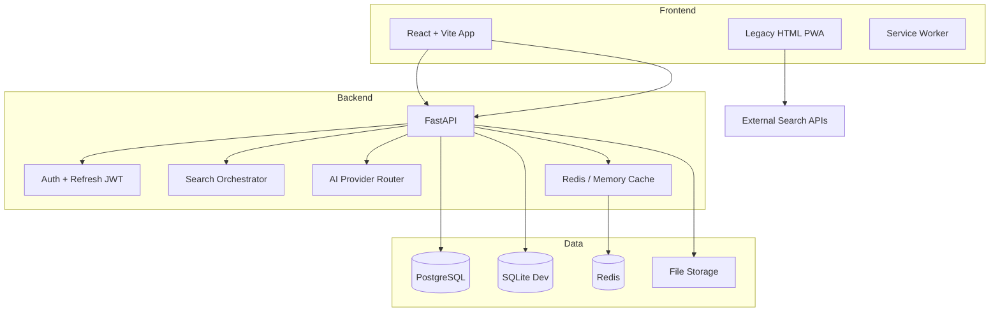
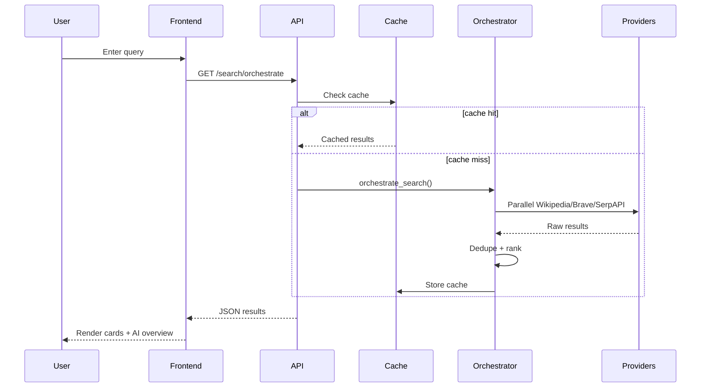

# Nebula Search v1.0 — Implementation Plan

## Current State (Post-Session)

| Phase | Status | Notes |
|-------|--------|-------|
| 1 Frontend ↔ Backend | **Partial** | React app with auth, orchestrated search, AI; legacy HTML preserved |
| 2 Frontend Modularization | **Partial** | Vite + React `src/` structure; legacy UI at `/legacy/` |
| 3 Database Evolution | **Partial** | SQLite + PostgreSQL migrations, repositories, 7 tables |
| 4 Redis Platform | **Partial** | `CacheService` with Redis + memory fallback |
| 5 Offline AI | **Partial** | OpenAI, Ollama, DuckDuckGo provider router |
| 6 Search Orchestrator | **Done (core)** | Expand → parallel → rank → dedupe → cache |
| 7 Complete PWA | **Partial** | manifest.json + service worker; install prompt pending |
| 8 Storage Platform | **Partial** | `storage/{uploads,cache,vector,indexes,exports}` dirs |
| 9 Production Deployment | **Partial** | Docker compose with Postgres/Redis; CI updated |
| 10 Mobile Roadmap | **Doc** | See [MOBILE.md](MOBILE.md) |

## Architecture



## Search Data Flow



## Folder Tree (Target v1.0)

```
Nebula-search-engine-/
├── frontend/
│   ├── src/               # React app
│   ├── public/            # PWA assets
│   └── legacy/            # Original monolithic UI
├── backend/app/
│   ├── database/          # engine, migrations, repositories
│   ├── providers/ai/      # OpenAI, Ollama, DuckDuckGo
│   ├── search/            # orchestrator
│   ├── routes/            # API endpoints
│   └── services/          # cache, auth, ai
├── storage/               # uploads, cache, vector, indexes, exports
├── tests/
├── docs/
└── docker/
```

## API Endpoints

| Method | Path | Description |
|--------|------|-------------|
| GET | `/health` | Health + db/cache status |
| POST | `/api/v1/auth/signup` | Register |
| POST | `/api/v1/auth/login` | Login (access + refresh) |
| POST | `/api/v1/auth/refresh` | Refresh access token |
| POST | `/api/v1/auth/logout` | Revoke refresh token |
| GET | `/api/v1/auth/me` | Current user |
| GET | `/api/v1/search/web` | Single-backend search (legacy) |
| GET | `/api/v1/search/orchestrate` | Multi-backend orchestrated search |
| GET | `/api/v1/search/history` | User search history |
| POST | `/api/v1/ai/ask` | AI answer |
| POST | `/api/v1/ai/ask/stream` | SSE stream (basic) |
| GET | `/api/v1/ai/chat/history` | Chat history |
| DELETE | `/api/v1/ai/chat/history` | Clear chat |
| POST | `/api/v1/ai/synthesize` | Synthesize snippets |

## Database Schema

- **users** — id, email, hashed_password, created_at
- **sessions** — refresh token hashes
- **search_logs** — query audit trail
- **chat_history** — AI conversation messages
- **documents** — uploaded file metadata
- **settings** — per-user JSON preferences
- **exports** — export job metadata

## Migration Path

1. Keep using SQLite locally (`DATABASE_URL=nebula.db`)
2. For production: set `DATABASE_URL=postgresql://...` and run Docker compose
3. Frontend: use React app at `/`; legacy at `/legacy/index.html`
4. Set `REDIS_URL` for shared cache across workers

## Testing Strategy

- Unit: auth, orchestrator, providers, cache
- Integration: API routes with httpx ASGI client
- Frontend: manual + future Playwright
- CI: pytest on Python 3.11/3.12, coverage ≥75%

## Rollout Phases

1. **v1.0-alpha** — Backend platform + React shell (current)
2. **v1.0-beta** — Full legacy feature parity in React
3. **v1.0-rc** — PostgreSQL/Redis production hardening
4. **v1.0** — PWA install, document upload, vector search
