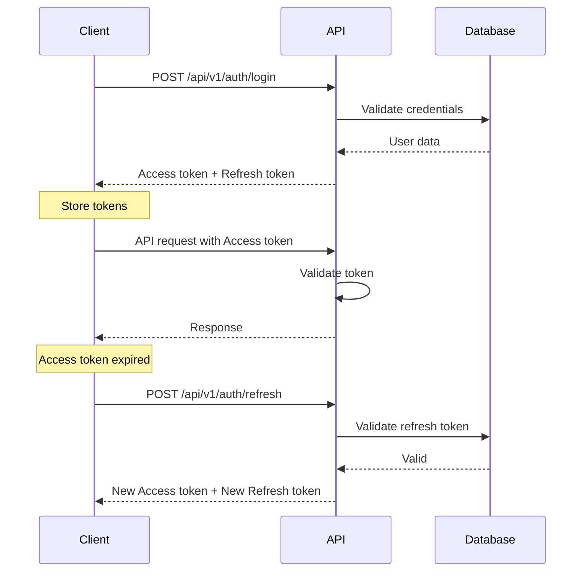

# Nebula Search Engine — OpenAPI 3.1 Specification

## Overview

This document provides the complete OpenAPI 3.1 specification for the Nebula Search Engine API. The API is designed to be production-ready, secure, and scalable.

**Base URL:** `http://localhost:8000`  
**API Version:** `1.0.0`  
**OpenAPI Version:** `3.1.0`  
**License:** MIT

---

## Table of Contents

1. [Introduction](#introduction)
2. [Authentication](#authentication)
3. [Error Handling](#error-handling)
4. [Pagination](#pagination)
5. [Filtering](#filtering)
6. [API Endpoints](#api-endpoints)
   - [Health](#health)
   - [Authentication](#authentication-endpoints)
   - [Users](#users)
   - [Search](#search)
   - [Documents](#documents)
   - [AI](#ai)
   - [Vector](#vector)
   - [Notifications](#notifications)
   - [Analytics](#analytics)
   - [Recommendations](#recommendations)
   - [Admin](#admin)
7. [Data Models](#data-models)
8. [Security](#security)

---

## Introduction

### API Principles

1. **RESTful Design:** All endpoints follow REST conventions
2. **Versioning:** API version included in URL path (`/api/v1/`)
3. **Consistent Responses:** Standardized success/error formats
4. **Security First:** JWT authentication, rate limiting, audit logging
5. **Performance:** Caching, connection pooling, async processing

### Request/Response Format

#### Standard Success Response
```json
{
  "success": true,
  "data": {},
  "meta": {
    "timestamp": "2026-07-04T10:00:00Z",
    "request_id": "uuid",
    "pagination": {}
  }
}
```

#### Standard Error Response
```json
{
  "success": false,
  "error": {
    "code": "VALIDATION_ERROR",
    "message": "Invalid input data",
    "details": [],
    "request_id": "uuid"
  }
}
```

---

## Authentication

### JWT Token Authentication

All authenticated endpoints require a Bearer token in the Authorization header:

```
Authorization: Bearer <access_token>
```

### Token Lifecycle

1. **Access Token:** 
   - Expires in 15 minutes (configurable)
   - Contains user ID, role, and permissions
   - Used for API authentication

2. **Refresh Token:**
   - Expires in 7 days (configurable)
   - Rotated on every use
   - Stored securely in database

### Authentication Flow



---

## Error Handling

### Error Codes

| Code | HTTP Status | Description |
|------|-------------|-------------|
| `VALIDATION_ERROR` | 400 | Invalid input data |
| `UNAUTHORIZED` | 401 | Missing or invalid authentication |
| `FORBIDDEN` | 403 | Insufficient permissions |
| `NOT_FOUND` | 404 | Resource not found |
| `CONFLICT` | 409 | Resource already exists |
| `RATE_LIMIT_EXCEEDED` | 429 | Too many requests |
| `INTERNAL_ERROR` | 500 | Server error |

### Error Response Format

```json
{
  "success": false,
  "error": {
    "code": "VALIDATION_ERROR",
    "message": "Invalid input data",
    "details": [
      {
        "field": "email",
        "message": "Invalid email format"
      }
    ],
    "request_id": "550e8400-e29b-41d4-a716-446655440000"
  }
}
```

---

## Pagination

### Cursor-Based Pagination

Used for large datasets (search results, notifications, etc.)

**Request Parameters:**
- `limit` (integer): Number of items per page (default: 20, max: 100)
- `cursor` (string): Pagination cursor from previous response

**Response Format:**
```json
{
  "success": true,
  "data": [...],
  "meta": {
    "pagination": {
      "cursor": "eyJpZCI6MTIz...",
      "next_cursor": "eyJpZCI6MTI0...",
      "has_more": true,
      "total": 1000
    }
  }
}
```

### Page-Based Pagination

Used for small collections (documents, settings, etc.)

**Request Parameters:**
- `page` (integer): Page number (default: 1, min: 1)
- `page_size` (integer): Items per page (default: 20, max: 100)

**Response Format:**
```json
{
  "success": true,
  "data": [...],
  "meta": {
    "pagination": {
      "page": 1,
      "page_size": 20,
      "total_pages": 5,
      "total_items": 100
    }
  }
}
```

---

## Filtering

### Query Parameters

- `filter[field]`: Filter by field value
- `filter[operator]`: Filter operator (eq, neq, gt, lt, gte, lte, in, nin)
- `sort`: Sort field (prefix with `-` for descending)
- `search`: Full-text search query

### Example

```
GET /api/v1/documents?filter[status]=indexed&filter[user_id]=123&sort=-created_at&search=machine learning
```

---

## API Endpoints

### Health

#### GET /
**Description:** API root endpoint  
**Authentication:** None  
**Rate Limit:** 100/min

**Response 200:**
```json
{
  "message": "Nebula Search API is running.",
  "docs": "/docs",
  "version": "2.0.0"
}
```

#### GET /api/v1/health
**Description:** Health check endpoint  
**Authentication:** None  
**Rate Limit:** 100/min

**Response 200:**
```json
{
  "success": true,
  "data": {
    "status": "healthy",
    "version": "2.0.0",
    "environment": "production",
    "timestamp": "2026-07-04T10:00:00Z",
    "database": "postgresql",
    "cache": "redis",
    "services": {
      "database": "healthy",
      "cache": "healthy",
      "queue": "healthy"
    }
  }
}
```

---

### Authentication Endpoints

#### POST /api/v1/auth/signup
**Description:** Register a new user account  
**Authentication:** None  
**Rate Limit:** 5/min

**Request Body:**
```json
{
  "email": "user@example.com",
  "password": "SecurePass123!",
  "first_name": "John",
  "last_name": "Doe"
}
```

**Validation Rules:**
- `email`: Required, valid email format, max 255 characters
- `password`: Required, min 8 characters, max 128, must contain uppercase, lowercase, number, special character
- `first_name`: Optional, max 100 characters
- `last_name`: Optional, max 100 characters

**Response 201 Created:**
```json
{
  "success": true,
  "data": {
    "message": "User created successfully. Please check your email to verify your account.",
    "user": {
      "id": 1,
      "email": "user@example.com",
      "first_name": "John",
      "last_name": "Doe",
      "email_verified": false,
      "created_at": "2026-07-04T10:00:00Z"
    }
  }
}
```

**Response 409 Conflict:**
```json
{
  "success": false,
  "error": {
    "code": "CONFLICT",
    "message": "Email already registered"
  }
}
```

---

#### POST /api/v1/auth/login
**Description:** Authenticate user and receive JWT tokens  
**Authentication:** None  
**Rate Limit:** 5/min

**Request Body:**
```json
{
  "email": "user@example.com",
  "password": "SecurePass123!"
}
```

**Response 200 OK:**
```json
{
  "success": true,
  "data": {
    "access_token": "eyJhbGciOiJIUzI1NiIsInR5cCI6IkpXVCJ9...",
    "token_type": "bearer",
    "refresh_token": "eyJhbGciOiJIUzI1NiIsInR5cCI6IkpXVCJ9...",
    "expires_in": 900,
    "user": {
      "id": 1,
      "email": "user@example.com",
      "role": "user",
      "first_name": "John",
      "last_name": "Doe",
      "email_verified": true
    }
  }
}
```

**Response 401 Unauthorized:**
```json
{
  "success": false,
  "error": {
    "code": "UNAUTHORIZED",
    "message": "Invalid email or password"
  }
}
```

**Response 423 Locked:**
```json
{
  "success": false,
  "error": {
    "code": "RATE_LIMIT_EXCEEDED",
    "message": "Account temporarily locked. Try again in 15 minutes.",
    "retry_after": 900
  }
}
```

---

#### POST /api/v1/auth/refresh
**Description:** Refresh access token using refresh token  
**Authentication:** None  
**Rate Limit:** 10/min

**Request Body:**
```json
{
  "refresh_token": "eyJhbGciOiJIUzI1NiIsInR5cCI6IkpXVCJ9..."
}
```

**Response 200 OK:**
```json
{
  "success": true,
  "data": {
    "access_token": "eyJhbGciOiJIUzI1NiIsInR5cCI6IkpXVCJ9...",
    "token_type": "bearer",
    "refresh_token": "eyJhbGciOiJIUzI1NiIsInR5cCI6IkpXVCJ9...",
    "expires_in": 900
  }
}
```

---

#### POST /api/v1/auth/logout
**Description:** Logout current session  
**Authentication:** Optional  
**Rate Limit:** 10/min

**Request Body:**
```json
{
  "refresh_token": "eyJhbGciOiJIUzI1NiIsInR5cCI6IkpXVCJ9..."
}
```

**Response 200 OK:**
```json
{
  "success": true,
  "data": {
    "message": "Logged out successfully"
  }
}
```

---

#### GET /api/v1/auth/me
**Description:** Get current user information  
**Authentication:** Required  
**Rate Limit:** 60/min

**Response 200 OK:**
```json
{
  "success": true,
  "data": {
    "id": 1,
    "email": "user@example.com",
    "role": "user",
    "first_name": "John",
    "last_name": "Doe",
    "email_verified": true,
    "created_at": "2026-01-01T00:00:00Z",
    "last_login": "2026-07-04T09:00:00Z"
  }
}
```

---

### Users

#### GET /api/v1/users/profile
**Description:** Get current user's profile  
**Authentication:** Required  
**Rate Limit:** 60/min

**Response 200 OK:**
```json
{
  "success": true,
  "data": {
    "id": 1,
    "email": "user@example.com",
    "role": "user",
    "first_name": "John",
    "last_name": "Doe",
    "phone_number": "+1234567890",
    "avatar_url": "https://cdn.example.com/avatars/1.jpg",
    "email_verified": true,
    "two_factor_enabled": false,
    "created_at": "2026-01-01T00:00:00Z",
    "last_login": "2026-07-04T09:00:00Z"
  }
}
```

---

#### PUT /api/v1/users/profile
**Description:** Update user profile  
**Authentication:** Required  
**Rate Limit:** 30/min

**Request Body:**
```json
{
  "first_name": "John",
  "last_name": "Doe",
  "phone_number": "+1234567890"
}
```

**Response 200 OK:**
```json
{
  "success": true,
  "data": {
    "id": 1,
    "first_name": "John",
    "last_name": "Doe",
    "phone_number": "+1234567890",
    "updated_at": "2026-07-04T10:05:00Z"
  }
}
```

---

### Search

#### POST /api/v1/search
**Description:** Unified search endpoint supporting web, vector, hybrid, and AI search modes  
**Authentication:** Required  
**Rate Limit:** 30/min

**Request Body:**
```json
{
  "query": "enterprise search architecture",
  "mode": "hybrid",
  "filters": {
    "date_range": {
      "start": "2026-01-01",
      "end": "2026-12-31"
    },
    "document_type": ["pdf", "docx"]
  },
  "page": 1,
  "limit": 20,
  "sort": "relevance",
  "include_ai_answer": true,
  "include_suggestions": true
}
```

**Validation Rules:**
- `query`: Required, 1-500 characters
- `mode`: Optional, enum: ["web", "vector", "hybrid", "ai"], default: "hybrid"
- `filters`: Optional, object
- `page`: Optional, min 1, default 1
- `limit`: Optional, min 1, max 50, default 20
- `sort`: Optional, enum: ["relevance", "date", "score"], default: "relevance"

**Response 200 OK:**
```json
{
  "success": true,
  "data": {
    "query": "enterprise search architecture",
    "mode": "hybrid",
    "results": [
      {
        "id": 1,
        "title": "Enterprise Search Architecture Guide",
        "snippet": "A comprehensive guide to building enterprise search...",
        "url": "https://example.com/guide",
        "source": "web",
        "score": 0.95,
        "document_id": 123,
        "highlights": [
          {
            "text": "enterprise search",
            "start": 10,
            "end": 28
          }
        ]
      }
    ],
    "ai_answer": {
      "answer": "Enterprise search architecture involves...",
      "provider": "openai",
      "citations": [
        {
          "document_id": 123,
          "chunk_id": 5,
          "snippet": "..."
        }
      ]
    },
    "suggestions": [
      "enterprise search best practices",
      "search architecture patterns"
    ],
    "total": 1,
    "response_time_ms": 234
  },
  "meta": {
    "timestamp": "2026-07-04T10:00:00Z",
    "request_id": "uuid",
    "pagination": {
      "page": 1,
      "limit": 20,
      "has_more": false
    },
    "cached": false
  }
}
```

**Response 404 Not Found:**
```json
{
  "success": false,
  "error": {
    "code": "NOT_FOUND",
    "message": "No results found for query: 'enterprise search architecture'"
  }
}
```

---

### Documents

#### GET /api/v1/documents
**Description:** List user's documents  
**Authentication:** Required  
**Rate Limit:** 60/min

**Query Parameters:**
- `page` (integer): Page number (default: 1)
- `page_size` (integer): Items per page (default: 20, max: 100)
- `filter[status]` (string): Filter by status (pending, indexing, indexed, error)
- `filter[document_type]` (string): Filter by file type
- `sort` (string): Sort field (created_at, filename, status)

**Response 200 OK:**
```json
{
  "success": true,
  "data": {
    "documents": [
      {
        "id": 1,
        "filename": "guide.pdf",
        "original_filename": "enterprise_guide.pdf",
        "content_type": "application/pdf",
        "file_size_bytes": 1024000,
        "status": "indexed",
        "indexed_at": "2026-07-04T09:00:00Z",
        "created_at": "2026-07-04T08:00:00Z",
        "updated_at": "2026-07-04T09:00:00Z"
      }
    ]
  },
  "meta": {
    "pagination": {
      "page": 1,
      "page_size": 20,
      "total_pages": 1,
      "total_items": 1
    }
  }
}
```

---

#### POST /api/v1/documents
**Description:** Upload a new document  
**Authentication:** Required  
**Rate Limit:** 20/min

**Request Body:** Multipart form data
- `file` (binary): Document file (max 10MB)
- `auto_index` (boolean): Automatically index after upload (default: true)

**Allowed File Types:** `.txt`, `.md`, `.json`, `.csv`, `.pdf`, `.html`, `.htm`, `.docx`

**Response 201 Created:**
```json
{
  "success": true,
  "data": {
    "id": 1,
    "filename": "guide.pdf",
    "original_filename": "enterprise_guide.pdf",
    "content_type": "application/pdf",
    "file_size_bytes": 1024000,
    "status": "pending",
    "created_at": "2026-07-04T10:00:00Z"
  }
}
```

**Response 413 Payload Too Large:**
```json
{
  "success": false,
  "error": {
    "code": "VALIDATION_ERROR",
    "message": "File too large (max 10MB)"
  }
}
```

---

#### DELETE /api/v1/documents/{id}
**Description:** Delete a document  
**Authentication:** Required  
**Rate Limit:** 20/min

**Path Parameters:**
- `id` (integer): Document ID

**Response 200 OK:**
```json
{
  "success": true,
  "data": {
    "message": "Document deleted successfully"
  }
}
```

**Response 404 Not Found:**
```json
{
  "success": false,
  "error": {
    "code": "NOT_FOUND",
    "message": "Document not found"
  }
}
```

---

### AI

#### POST /api/v1/ai/ask
**Description:** Get AI-powered answer (deprecated, use `/search` with mode: "ai")  
**Authentication:** Required  
**Rate Limit:** 20/min

**Request Body:**
```json
{
  "prompt": "What is artificial intelligence?"
}
```

**Response 200 OK:**
```json
{
  "success": true,
  "data": {
    "answer": "Artificial intelligence (AI) is...",
    "provider": "openai",
    "model": "gpt-4",
    "tokens_used": 150,
    "response_time_ms": 2340
  }
}
```

---

#### POST /api/v1/ai/ask/stream
**Description:** Stream AI response (Server-Sent Events)  
**Authentication:** Required  
**Rate Limit:** 20/min

**Request Body:**
```json
{
  "prompt": "Explain quantum computing"
}
```

**Response 200 OK (text/event-stream):**
```
data: {"chunk": "Quantum"}

data: {"chunk": " computing"}

data: {"chunk": " is"}

data: {"chunk": " a type"}

data: {"chunk": " of computation"}

data: [DONE]
```

---

### Vector

#### POST /api/v1/vector/search
**Description:** Hybrid vector + keyword search (deprecated, use `/search` with mode: "vector")  
**Authentication:** Required  
**Rate Limit:** 30/min

**Request Body:**
```json
{
  "query": "machine learning algorithms",
  "top_k": 10,
  "filters": {
    "document_type": "pdf"
  },
  "hybrid_weight": 0.7
}
```

**Response 200 OK:**
```json
{
  "success": true,
  "data": {
    "query": "machine learning algorithms",
    "total": 3,
    "results": [
      {
        "document_id": 1,
        "chunk_id": 5,
        "filename": "ml_guide.pdf",
        "content": "Machine learning algorithms can be categorized into...",
        "score": 0.92,
        "vector_score": 0.88,
        "keyword_score": 0.95,
        "highlights": [
          {
            "text": "machine learning algorithms",
            "start": 0,
            "end": 26
          }
        ]
      }
    ]
  }
}
```

---

#### POST /api/v1/vector/ask
**Description:** RAG query with citations (deprecated, use `/search` with mode: "ai")  
**Authentication:** Required  
**Rate Limit:** 20/min

**Request Body:**
```json
{
  "query": "What are the main topics in my documents?",
  "top_k": 5
}
```

**Response 200 OK:**
```json
{
  "success": true,
  "data": {
    "query": "What are the main topics in my documents?",
    "answer": "The main topics in your documents are...",
    "citations": [
      {
        "id": 1,
        "document_id": 1,
        "chunk_id": 5,
        "query": "main topics",
        "snippet": "The main topics include...",
        "score": 0.92,
        "created_at": "2026-07-04T10:00:00Z"
      }
    ],
    "sources": [
      "ml_guide.pdf",
      "ai_basics.pdf"
    ]
  }
}
```

---

### Admin

#### GET /api/v1/admin/users
**Description:** List all users (admin only)  
**Authentication:** Admin  
**Rate Limit:** 30/min

**Query Parameters:**
- `page` (integer): Page number (default: 1)
- `page_size` (integer): Items per page (default: 20, max: 100)
- `filter[role]` (string): Filter by role
- `filter[status]` (string): Filter by status (active, disabled)
- `search` (string): Search by email or name

**Response 200 OK:**
```json
{
  "success": true,
  "data": {
    "users": [
      {
        "id": 1,
        "email": "user@example.com",
        "role": "user",
        "first_name": "John",
        "last_name": "Doe",
        "email_verified": true,
        "is_locked": false,
        "created_at": "2026-01-01T00:00:00Z",
        "last_login": "2026-07-04T09:00:00Z"
      }
    ]
  },
  "meta": {
    "pagination": {
      "page": 1,
      "page_size": 20,
      "total_pages": 1,
      "total_items": 1
    }
  }
}
```

---

#### GET /api/v1/admin/stats
**Description:** Get system statistics (admin only)  
**Authentication:** Admin  
**Rate Limit:** 10/min

**Response 200 OK:**
```json
{
  "success": true,
  "data": {
    "users": {
      "total": 100,
      "active": 85,
      "new_today": 5
    },
    "documents": {
      "total": 500,
      "indexed": 450,
      "pending": 50
    },
    "search": {
      "total_today": 1000,
      "avg_latency_ms": 234,
      "cache_hit_ratio": 0.85
    },
    "system": {
      "cpu_usage": 45.2,
      "memory_usage": 62.5,
      "disk_usage": 78.3,
      "uptime_seconds": 86400
    }
  }
}
```

---

## Data Models

### User
```typescript
interface User {
  id: number;
  email: string;
  role: "user" | "admin" | "guest";
  first_name?: string;
  last_name?: string;
  phone_number?: string;
  avatar_url?: string;
  email_verified: boolean;
  two_factor_enabled: boolean;
  created_at: string;
  last_login?: string;
}
```

### Document
```typescript
interface Document {
  id: number;
  filename: string;
  original_filename: string;
  content_type: string;
  file_size_bytes: number;
  status: "pending" | "indexing" | "indexed" | "error" | "duplicate";
  indexed_at?: string;
  error_message?: string;
  created_at: string;
  updated_at: string;
}
```

### SearchResult
```typescript
interface SearchResult {
  id: number;
  title: string;
  snippet: string;
  url: string;
  source: "web" | "vector" | "hybrid";
  score: number;
  document_id?: number;
  highlights?: Array<{
    text: string;
    start: number;
    end: number;
  }>;
}
```

### AIAnswer
```typescript
interface AIAnswer {
  answer: string;
  provider: string;
  model?: string;
  tokens_used?: number;
  response_time_ms: number;
  citations?: Array<{
    document_id: number;
    chunk_id: number;
    snippet: string;
  }>;
}
```

---

## Security

### Authentication

All authenticated endpoints require a valid JWT token:

```
Authorization: Bearer <access_token>
```

### Authorization

| Role | Permissions |
|------|-------------|
| `guest` | `search:read` |
| `user` | `search:read`, `documents:read`, `documents:write`, `profile:read`, `profile:write` |
| `admin` | `*` (all permissions) |

### Rate Limiting

| Tier | Limit | Window |
|------|-------|--------|
| Public | 100 requests | 1 minute |
| Authenticated | 60 requests | 1 minute |
| Admin | 30 requests | 1 minute |
| Write | 10 requests | 1 minute |

Rate limit headers are included in all responses:

```
X-RateLimit-Limit: 60
X-RateLimit-Remaining: 59
X-RateLimit-Reset: 1625424000
```

### CORS

Allowed origins are configured in the server. The following headers are allowed:

```
Access-Control-Allow-Origin: <configured-origins>
Access-Control-Allow-Methods: GET, POST, PUT, DELETE, PATCH, OPTIONS
Access-Control-Allow-Headers: Authorization, Content-Type, X-API-Key
Access-Control-Allow-Credentials: true
```

### Security Headers

All responses include security headers:

```
Strict-Transport-Security: max-age=31536000; includeSubDomains
X-Content-Type-Options: nosniff
X-Frame-Options: DENY
X-XSS-Protection: 1; mode=block
Content-Security-Policy: default-src 'self'
```

---

## Appendix A: Complete Endpoint List

### Health (2 endpoints)
- `GET /`
- `GET /api/v1/health`

### Authentication (15 endpoints)
- `POST /api/v1/auth/signup`
- `POST /api/v1/auth/login`
- `POST /api/v1/auth/refresh`
- `POST /api/v1/auth/logout`
- `POST /api/v1/auth/logout-all`
- `GET /api/v1/auth/me`
- `GET /api/v1/auth/verify-email`
- `POST /api/v1/auth/resend-verification`
- `POST /api/v1/auth/forgot-password`
- `POST /api/v1/auth/reset-password`
- `POST /api/v1/auth/change-password`
- `POST /api/v1/auth/change-email`
- `DELETE /api/v1/auth/account`
- `GET /api/v1/auth/sessions`
- `DELETE /api/v1/auth/sessions/{id}`

### Users (7 endpoints)
- `GET /api/v1/users/profile`
- `PUT /api/v1/users/profile`
- `GET /api/v1/users/preferences`
- `PUT /api/v1/users/preferences`
- `GET /api/v1/users/activity`
- `POST /api/v1/users/avatar`
- `DELETE /api/v1/users/avatar`

### Search (8 endpoints)
- `POST /api/v1/search`
- `GET /api/v1/search/suggestions`
- `GET /api/v1/search/autocomplete`
- `GET /api/v1/search/history`
- `DELETE /api/v1/search/history`
- `POST /api/v1/search/save`
- `GET /api/v1/search/saved`
- `DELETE /api/v1/search/saved/{id}`

### Documents (9 endpoints)
- `GET /api/v1/documents`
- `POST /api/v1/documents`
- `GET /api/v1/documents/{id}`
- `PUT /api/v1/documents/{id}`
- `DELETE /api/v1/documents/{id}`
- `POST /api/v1/documents/{id}/reindex`
- `GET /api/v1/documents/{id}/status`
- `POST /api/v1/documents/batch-upload`
- `POST /api/v1/documents/batch-delete`

### AI (5 endpoints)
- `POST /api/v1/ai/ask` (deprecated)
- `POST /api/v1/ai/ask/stream` (deprecated)
- `GET /api/v1/ai/chat/history`
- `DELETE /api/v1/ai/chat/history`
- `POST /api/v1/ai/synthesize`

### Vector (9 endpoints)
- `POST /api/v1/vector/search` (deprecated)
- `POST /api/v1/vector/ask` (deprecated)
- `GET /api/v1/vector/citations`
- `GET /api/v1/vector/stats`
- `POST /api/v1/vector/export`
- `POST /api/v1/vector/documents/{id}/reindex`
- `POST /api/v1/vector/documents/reindex-all`
- `POST /api/v1/vector/documents/{id}/index-now`
- `DELETE /api/v1/vector/cache`

### Notifications (8 endpoints)
- `GET /api/v1/notifications`
- `GET /api/v1/notifications/unread-count`
- `POST /api/v1/notifications/{id}/read`
- `POST /api/v1/notifications/read-all`
- `DELETE /api/v1/notifications/{id}`
- `DELETE /api/v1/notifications`
- `GET /api/v1/notifications/preferences`
- `PUT /api/v1/notifications/preferences`

### Analytics (4 endpoints)
- `GET /api/v1/analytics/usage`
- `GET /api/v1/analytics/search`
- `GET /api/v1/analytics/performance`
- `GET /api/v1/analytics/export`

### Recommendations (3 endpoints)
- `GET /api/v1/recommendations/related`
- `GET /api/v1/recommendations/personalized`
- `GET /api/v1/recommendations/similar-searches`

### Admin (16 endpoints)
- `GET /api/v1/admin/users`
- `GET /api/v1/admin/users/{id}`
- `PUT /api/v1/admin/users/{id}/role`
- `PUT /api/v1/admin/users/{id}/status`
- `DELETE /api/v1/admin/users/{id}`
- `GET /api/v1/admin/audit-logs`
- `GET /api/v1/admin/sessions`
- `POST /api/v1/admin/sessions/{id}/revoke`
- `GET /api/v1/admin/stats`
- `GET /api/v1/admin/health/detailed`
- `POST /api/v1/admin/cache/clear`
- `POST /api/v1/admin/queue/pause`
- `POST /api/v1/admin/queue/resume`
- `GET /api/v1/admin/queue/status`
- `GET /api/v1/admin/analytics/overview`
- `GET /api/v1/admin/errors`

**Total: 45 endpoints**

---

## Appendix B: Postman Collection

A complete Postman collection is available at:
```
docs/postman/nebula-api-collection.json
```

Import this collection into Postman to test all endpoints with pre-configured requests, variables, and test scripts.

---

## Appendix C: SDK Examples

### Python
```python
import requests

BASE_URL = "http://localhost:8000"

# Login
response = requests.post(f"{BASE_URL}/api/v1/auth/login", json={
    "email": "user@example.com",
    "password": "SecurePass123!"
})
tokens = response.json()
access_token = tokens["access_token"]

# Search
headers = {"Authorization": f"Bearer {access_token}"}
response = requests.post(
    f"{BASE_URL}/api/v1/search",
    headers=headers,
    json={
        "query": "enterprise search",
        "mode": "hybrid",
        "limit": 10
    }
)
results = response.json()
```

### JavaScript
```javascript
const BASE_URL = "http://localhost:8000";

// Login
const loginResponse = await fetch(`${BASE_URL}/api/v1/auth/login`, {
  method: "POST",
  headers: { "Content-Type": "application/json" },
  body: JSON.stringify({
    email: "user@example.com",
    password: "SecurePass123!"
  })
});
const { access_token } = await loginResponse.json();

// Search
const searchResponse = await fetch(`${BASE_URL}/api/v1/search`, {
  method: "POST",
  headers: {
    "Content-Type": "application/json",
    "Authorization": `Bearer ${access_token}`
  },
  body: JSON.stringify({
    query: "enterprise search",
    mode: "hybrid",
    limit: 10
  })
});
const results = await searchResponse.json();
```

---

## Conclusion

This OpenAPI 3.1 specification provides a complete contract for the Nebula Search Engine API. It includes:

- ✅ 45 endpoints across 8 domains
- ✅ Standardized request/response formats
- ✅ Comprehensive error handling
- ✅ Pagination and filtering
- ✅ Security and authentication
- ✅ Rate limiting
- ✅ Complete data models
- ✅ Postman collection for testing
- ✅ SDK examples

**Next Steps:**
1. Import Postman collection for testing
2. Review and approve API design
3. Toggle to Act mode to begin implementation